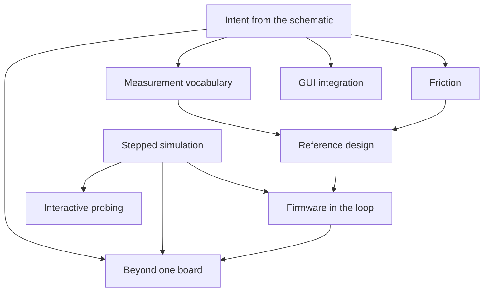

# Roadmap

Ordered by dependency and by risk retired, not by date. Each phase is
usable on its own, and each one is picked so that failing early is cheap.

## The thesis

Engineers do not simulate because simulating costs them a second design.
KiCad ships a simulator, and it is largely unused, because using it means
adding SPICE sources to the schematic and wiring them in: the drawing you
simulate stops being the drawing you fabricate.

kitest slots into a design that already exists. Nothing SPICE-specific
goes into the schematic. Stimulus, analyses and assertions come from the
test side and attach to nets the design already labels. What the user
adds is intent, not scaffolding.

Intent is the part a tool cannot infer. DRC checks manufacturability and
ERC checks wiring, both from generic rules. kitest checks what this
particular circuit is supposed to do, which only the designer knows.

## Done

- ngspice backend: operating point, transient, AC sweep, each returning
  its own result type so a wrong-domain read is a compile error.
- Typed stimulus per analysis, so a DC supply cannot reach an AC sweep.
- Measurement vocabulary: `settles_to`, `overshoot`, `gain_db_at`,
  `phase_deg_at`, `near`, and `dominant_tone` with frequency, amplitude
  and samples per cycle.
- Frequency measurement end to end: non-uniform resampling, Hann window,
  real FFT, sub-bin peak interpolation, window-loss correction.
- `kicad-cli` SPICE export, locked against a committed golden netlist.
- The `kicadxml` export read back as each example is drawn: every part,
  net, pin type, and model field, stated by hand rather than recorded, so a
  `kicad-cli` change cannot be re-recorded into a passing test.
- A Python surface mirroring the Rust one, and shared netlist fixtures
  so both languages exercise one artifact per circuit.
- A real oscillator measured: 2N3904 Colpitts at 10.15 MHz.
- A failed check diagnosed from the operating point: the probe net's DC
  bias, each BJT off, saturated or active, and a labelled net at 0 V on a
  collector or drain named as an undriven supply. `kitest --sketch PROBE`
  sketches the waveform an oscillation check ran on, in the terminal.
- An oscillation check on a design with a crystal says crystal
  oscillators are not supported yet, instead of a misleading "still
  starting": a Q of 10^4 to 10^6 outruns the longest transient.

## Intent from the schematic

The core of the product. A user declares what a net should do, and gets
pass or fail, without writing simulator parameters.

- A probe symbol library. The user drops a probe on a net in the GUI and
  fills in fields: what to measure, the expected value, the tolerance.
  The symbol is `exclude_from_sim`, so it is annotation and not circuit.
- Read intent through `kicad-cli sch export netlist --format kicadxml`,
  which carries every component field and full net connectivity. No
  plugin and no API, so this works on KiCad today.
- A source-independent `Probe` model, and a `Design` seam behind which a
  KiCad project sits now and a live editor session sits later.
- The same model also fills from a plain test file keyed on net labels,
  so a user can adopt kitest without touching the schematic at all.
- A runner and a report. Pass or fail per probe, and on failure the
  measured value beside the expected one.

## Measurement vocabulary

Breadth, so that intent worth declaring can be expressed.

- A current-source stimulus. It unblocks four things at once: kicking a
  node to start a self-starting circuit, injecting noise where a circuit
  resonates rather than at its supply, probing a port's impedance, and
  measuring negative-resistance margin.
- Oscillation against resonance. Sweeping the kick separates them: a
  resonance scales with the kick, an oscillator ignores it.
- Time domain: ripple, rise and fall time, settling with overshoot.
- Frequency domain: bandwidth, phase margin, harmonic distortion.
- The static checks ERC cannot do, where the oracle is a datasheet
  rather than a rule. A crystal's load capacitors are the clearest case:
  wrong values pull the clock by hundreds of ppm, or stop it starting,
  and no connectivity rule can see it.

## Friction

The test should contain the design and the intent, and nothing else.

- Run parameters from intent: an expected frequency fixes the timebase,
  an expected settling time fixes the run length. The user should not be
  inventing a timestep.
- Diagnostics as a first-class surface. A failed assertion needs the
  spectrum, or the waveform, or the search the runner performed. An
  opaque failure is worse than no test.
- A scope that shows every run, without being asked twice; see Scope.
- An interactive mode: `kitest` in a KiCad project asks which net and
  what it should do, runs, and saves the result as a test. The analysis
  follows from the probes, never from a menu.
- An install check for `ngspice` and `kicad-cli`, so a missing tool is
  a clear first message rather than a spawn error.

## Scope

An oscilloscope, spectrum analyser, and VNA in one window, with the one
thing none of them has: the test's expectation drawn on the plot. It is
the `kitest-scope` crate, standalone and egui underneath; kitest supplies
the measurements, so the numbers shown are the numbers asserted.

The data path is files. kitest writes each capture to the project's
`.kitest/captures/`, ignored by git, and the scope reads them. A capture
carries a stable identity (project, probe or net, analysis, corner) and
the run's metadata, so a re-run lands where the last one did.

Done:
- The capture file, a versioned JSON transient or AC sweep, written by
  `Transient::capture` and `Spectra::capture`.
- A window that opens a capture: a stack of panes over one linked x axis,
  each pane holding one or more traces of one unit on its own y axis.
  Right-clicking a pane moves a trace into a new or another pane.
- Scroll to zoom x, Ctrl+scroll to zoom y, middle or Ctrl+left drag to
  pan, right drag to zoom to a box; SI units; 1-2-5 grid lines; min/max
  decimation per pixel; a live readout of every trace at the pointer.
- Cursors A and B with delta x, 1/delta x, and delta y per trace.
- Measurements picked per pane, from `kitest-measure`, the crate kitest's
  checks use: min, max, peak to peak, mean, RMS, frequency, rise and fall
  time, and the -3 dB points, over the visible window or between the
  cursors.
- Bode magnitude and unwrapped phase on a log frequency axis.
- PNG and CSV export.
- One live window with a fixed `app_id`: later launches hand it their
  capture through a Unix socket. It reloads the current file in place,
  keeps layout, cursors and zoom, and fades the previous run behind the
  new one. Captures of one identity at different corners overlay as a
  family.
- Version-2 captures carry a stable name, corner, and checked regions.
  Time bands and spectrum frequency bands are shaded and coloured by
  their verdict; pane headers carry the full PASS or FAIL message.
- `kitest --show PROBE` writes `.kitest/captures/` and opens the live
  scope; `--sketch` keeps the terminal view. Rust and Python can
  explicitly attach a `Check` to a capture and save it.
- A Hann-windowed spectrum of the visible time window, in dBV, with the
  dominant tone and its harmonics marked.
- Bode transfer functions against a selected reference trace, gain and
  phase margin, and group delay.
- An optional trace, level, and edge trigger that aligns re-runs to time
  zero.

One window, live:
- Tabs and side-by-side splits beside the stacked panes, through
  `egui_tiles`.
- A capture-directory picker and the choice to refit instead of holding
  zoom on reload.

Instruments:
- Oscilloscope: overshoot against the test's target.
- Spectrum analyser: a noise-floor line and peak and harmonic labels.
- VNA: Smith and polar charts once a port or impedance probe exists.

## Reference design

A board that exercises the tool and is worth building on its own.

- Filter for what goes on it: every feature must have a closed-form
  expected value, so the assertion is independent of the simulation.
- Colpitts oscillator first: `f = 1 / (2 pi sqrt(L C))`, measured on the
  bench with an AD3 and a VNA, with measured L and C fed back into the
  model. The gap between nominal and measured is the interesting result.
- Then I/Q modulation and demodulation, OFDM and 4-QAM, aiming at a
  Tiny Tapeout digital baseband with the analog front end on the board.

## Stepped simulation

The one architectural change that is certain. Both firmware co-simulation
and interactive probing need a simulation that can be advanced, read and
perturbed, rather than run to completion and parsed.

- A second `Backend` driving `ngspice -p` over a pipe: `.tran` declared
  in the deck, `step` to advance, `alter` to perturb. Batch stays for
  everything that does not need stepping.
- Settled in `notes/open-questions.md`: indexed reads of
  `v(node)[length-1]`, 0.588 ms per step, read and alter, and no
  `libngspice`, so ngspice's GPL stays behind the process boundary.

## Firmware in the loop

- A behavioural clock source, so an MCU's oscillator does not have to be
  simulated at all.
- A pin boundary: GPIO as sources, ADC as node reads, driven first by a
  scriptable stand-in to retire the time-synchronisation risk on a
  boundary we control.
- Then the real compiled ELF on Renode, which makes the work language
  and RTOS agnostic because it executes the binary. The deep part is the
  clock bridge between an adaptive analog timestep and instruction
  stepping.

## GUI integration

KiCad 10 has no IPC API for the schematic editor, and no announced date.
Everything above is designed so that when it arrives, adopting it is
small.

- A live `Design` implementation reading from a running editor.
- Probe creation from a selection: click a net, declare what it should
  do. The probe symbol representation is chosen so the API will be able
  to create it.
- A run trigger inside the editor, which is the one thing that cannot be
  built today.

## Beyond one board

Plants and other boards are the same mechanism: something joined to the
design at named connector pins, with each side's nets prefixed so full
net names stay unique. Vendor silicon is a different problem, solved at
the part rather than the connector. Ordered easiest first.

- Plants: reusable behavioural models attached at a connector, such as a
  BLDC motor (phase R and L, back-EMF from speed and rotor angle,
  mechanics as behavioural sources) on an ESC's motor connector, a
  battery, a load, a thermal mass. Plants too complex for SPICE run
  beside ngspice through stepped simulation.
- Multi-board projects: a workspace file, like a Cargo workspace, naming
  the boards and mapping connector pins between them, with the cable as
  a model (straight or mirrored, R and L or a transmission line) and a
  shared ground. Workspace conditions live there, never a second home
  for a board's own.
- Vendor silicon: never simulate the chip, verify the board's
  obligations to it. A contract file per part number, beside the model
  libraries, lists supply ranges and sequencing, strap pins and when
  they are sampled, reset timing, required external parts such as RSET,
  and crystal requirements, with IBIS for the I/O buffers. Whether a
  link comes up belongs to firmware in the loop, with the part as a
  register stub. The hard part is writing contracts, not checking them:
  a shared, human-reviewed contract library is the goal.
- An optional LLM tool that drafts a contract from a datasheet, outside
  the core so kitest never depends on a model provider. Every value
  carries its page and a verbatim quote, and a mechanical check confirms
  the quote is in the PDF. Contract pins are checked against the KiCad
  symbol's. A draft stays marked as one until a person reviews it, and a
  run on a draft says so. Local models are supported, since vendor
  datasheets are often under NDA. Accuracy is measured against
  hand-written contracts for parts with public datasheets.
- Behavioural models for parts whose vendor model is encrypted or will
  not run in ngspice, common for TI power parts. One agent extracts a
  cited spec, a second builds the model from the spec alone, and a check
  compares the model against the datasheet's typical-performance curves,
  which the builder never saw. The same clean-room split can turn an
  unencrypted but non-redistributable vendor model into one the registry
  can carry, where that model's licence permits reading it for this.
  Never decrypt a vendor model.
- A `dialect` field on model library entries (`pspice`, `ltspice`),
  translated with ngspice's include-only compatibility modes so kitest's
  own deck stays native ngspice.

## Far horizon

- Corners and Monte Carlo over component tolerance.
- A second backend behind the `Backend` trait, Xyce or a PSS-capable
  engine, for high-Q oscillators that a transient cannot reach.
- Parasitic extraction from layout, which is where a schematic-level
  load capacitance check stops being an estimate.
- A closed loop for automated iteration: propose a value, run, read,
  adjust. The headless surface is the substrate for it.
- A shared registry of contracts, model cards and plants, keyed by
  manufacturer and part number and versioned by datasheet and silicon
  revision. It starts as a reviewed git repository, as KiCad's libraries
  do, before any hosted service. Each entry records its source and review
  state, with vendor-published entries marked as such. Entries derived
  from NDA datasheets cannot be published, and vendor SPICE models often
  forbid redistribution, so each entry carries its licence.

## Standing obligations

- A CLA before accepting outside contributions, since the licence is
  LGPL-3.0-or-later and relicensing later needs every contributor.
- Generated type stubs. They are hand-maintained today and have already
  drifted once.
- Packaging: a real version, metadata, and an installable wheel.
