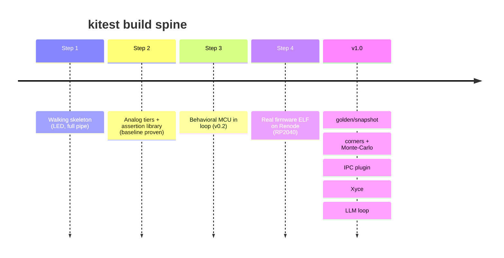

# Roadmap

Built as a spine of small increments, each of which retires one risk and is
independently verifiable. A single **RP2040 reference/dogfood board** (LED,
ADC-input node, PWM/RC "DAC" output) drives the work and doubles as kitest's own
self-test. Design filter for the board: every feature must have a closed-form
expected value (LED current; `Vout = duty x Vcc`; divider -> ADC code) so it can
be asserted. The neopixel is deferred (WS2812 is digital-timing and needs PIO,
off-axis and hard to emulate).

## Step 1: walking skeleton

- One feature (the LED) all the way through the pipe: `kicad-cli` export -> slice
  -> ngspice -> one assertion. Pure analog. Proves the pipeline is real.

## Step 2: analog tiers + assertion library ("baseline proven")

- ngspice batch backend: run a netlist, parse results.
- Static/connectivity assertions off the netlist (no SPICE).
- Smoke test: DC convergence, no floating nodes, nothing over abs-max.
- Domain assertion library (`settles_to`, `overshoot`, `ripple_pp`, `gain_at`,
  `phase_margin`, `current_draw`, `no_node_exceeds`).
- `kicad-cli` export wrapper and sheet or selection boundary slicing.
- pytest-based authoring, scaffolding (`kitest new`).
- Regression tests accumulate here and keep the later co-sim steps honest.

## Step 3: behavioral MCU in the loop (v0.2)

- A scriptable Python pin-driver standing in for an MCU at the I/O boundary (GPIO
  and PWM as sources, ADC as node reads), closing an analog<->digital loop. No
  real firmware yet. Retires the co-sim boundary and time-synchronization risk on
  a boundary we fully control. Throwaway scaffold.

## Step 4: real firmware in the loop

- The actual compiled ELF runs on Renode (RP2040 first, for mature emulation) and
  its peripheral accesses bridge to the same pin boundary. Language- and
  RTOS-agnostic because it runs the binary. Work is the emulator's peripheral
  fidelity plus the ngspice co-sim clock bridge (ours to build; time-sync is the
  deep part).

## Toward v1.0

- Golden and snapshot testing, corners and Monte-Carlo sweeps, a KiCad IPC plugin
  frontend, an Xyce backend behind the `Backend` trait, and vendor model dialect
  import.
- A closed feedback loop for automated/LLM-driven iteration (propose a value, run,
  read the result, adjust), for which the headless code-first surface is the
  substrate.
- Far horizon: parasitic extraction from layout. Genuinely hard (a whole EDA
  discipline); noted as direction, not a near-term item.
