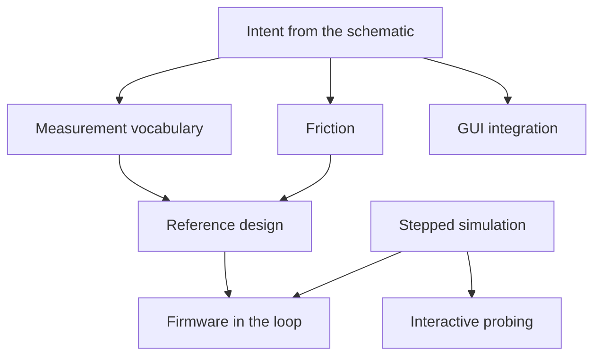

# Roadmap

Ordered by dependency and by risk retired, not by date. Each phase is
usable on its own, and each one is picked so that failing early is cheap.

## The thesis

Engineers do not simulate because simulating costs them a second design.
KiCad ships a simulator, and it is largely unused, because using it means
adding SPICE sources to the schematic and wiring them in: the drawing you
simulate stops being the drawing you fabricate.

kitest slots into a design that already exists. Nothing SPICE-specific
goes into the schematic. Stimulus, analyses and assertions come from the
test side and attach to nets the design already labels. What the user
adds is intent, not scaffolding.

Intent is the part a tool cannot infer. DRC checks manufacturability and
ERC checks wiring, both from generic rules. kitest checks what this
particular circuit is supposed to do, which only the designer knows.

## Done

- ngspice backend: operating point, transient, AC sweep, each returning
  its own result type so a wrong-domain read is a compile error.
- Typed stimulus per analysis, so a DC supply cannot reach an AC sweep.
- Measurement vocabulary: `settles_to`, `overshoot`, `gain_db_at`,
  `phase_deg_at`, `near`, and `dominant_tone` with frequency, amplitude
  and samples per cycle.
- Frequency measurement end to end: non-uniform resampling, Hann window,
  real FFT, sub-bin peak interpolation, window-loss correction.
- `kicad-cli` SPICE export, locked against a committed golden netlist.
- A Python surface mirroring the Rust one, and shared netlist fixtures
  so both languages exercise one artifact per circuit.
- A real oscillator measured: 2N3904 Colpitts at 10.15 MHz.

## Intent from the schematic

The core of the product. A user declares what a net should do, and gets
pass or fail, without writing simulator parameters.

- A probe symbol library. The user drops a probe on a net in the GUI and
  fills in fields: what to measure, the expected value, the tolerance.
  The symbol is `exclude_from_sim`, so it is annotation and not circuit.
- Read intent through `kicad-cli sch export netlist --format kicadxml`,
  which carries every component field and full net connectivity. No
  plugin and no API, so this works on KiCad today.
- A source-independent `Probe` model, and a `Design` seam behind which a
  KiCad project sits now and a live editor session sits later.
- The same model also fills from a plain test file keyed on net labels,
  so a user can adopt kitest without touching the schematic at all.
- Lock the XML export against a golden file, as the SPICE export already
  is: it is a second contract with `kicad-cli`.
- A runner and a report. Pass or fail per probe, and on failure the
  measured value beside the expected one.

## Measurement vocabulary

Breadth, so that intent worth declaring can be expressed.

- A current-source stimulus. It unblocks four things at once: kicking a
  node to start a self-starting circuit, injecting noise where a circuit
  resonates rather than at its supply, probing a port's impedance, and
  measuring negative-resistance margin.
- Oscillation against resonance. Sweeping the kick separates them: a
  resonance scales with the kick, an oscillator ignores it.
- Time domain: ripple, rise and fall time, settling with overshoot.
- Frequency domain: bandwidth, phase margin, harmonic distortion.
- The static checks ERC cannot do, where the oracle is a datasheet
  rather than a rule. A crystal's load capacitors are the clearest case:
  wrong values pull the clock by hundreds of ppm, or stop it starting,
  and no connectivity rule can see it.

## Friction

The test should contain the design and the intent, and nothing else.

- Run parameters from intent: an expected frequency fixes the timebase,
  an expected settling time fixes the run length. The user should not be
  inventing a timestep.
- Diagnostics as a first-class surface. A failed assertion needs the
  spectrum, or the waveform, or the search the runner performed. An
  opaque failure is worse than no test.

## Reference design

A board that exercises the tool and is worth building on its own.

- Filter for what goes on it: every feature must have a closed-form
  expected value, so the assertion is independent of the simulation.
- Colpitts oscillator first: `f = 1 / (2 pi sqrt(L C))`, measured on the
  bench with an AD3 and a VNA, with measured L and C fed back into the
  model. The gap between nominal and measured is the interesting result.
- Then I/Q modulation and demodulation, OFDM and 4-QAM, aiming at a
  Tiny Tapeout digital baseband with the analog front end on the board.

## Stepped simulation

The one architectural change that is certain. Both firmware co-simulation
and interactive probing need a simulation that can be advanced, read and
perturbed, rather than run to completion and parsed.

- `libngspice` in place of the `ngspice -b` subprocess, behind the
  existing `Backend` seam. Batch stays for everything that does not need
  stepping.
- Gate: linking `libngspice` links GPL code, where the subprocess
  boundary currently keeps kitest's licensing independent. Decide
  deliberately before starting.

## Firmware in the loop

- A behavioural clock source, so an MCU's oscillator does not have to be
  simulated at all.
- A pin boundary: GPIO as sources, ADC as node reads, driven first by a
  scriptable stand-in to retire the time-synchronisation risk on a
  boundary we control.
- Then the real compiled ELF on Renode, which makes the work language
  and RTOS agnostic because it executes the binary. The deep part is the
  clock bridge between an adaptive analog timestep and instruction
  stepping.

## GUI integration

KiCad 10 has no IPC API for the schematic editor, and no announced date.
Everything above is designed so that when it arrives, adopting it is
small.

- A live `Design` implementation reading from a running editor.
- Probe creation from a selection: click a net, declare what it should
  do. The probe symbol representation is chosen so the API will be able
  to create it.
- A run trigger inside the editor, which is the one thing that cannot be
  built today.

## Far horizon

- Corners and Monte Carlo over component tolerance.
- A second backend behind the `Backend` trait, Xyce or a PSS-capable
  engine, for high-Q oscillators that a transient cannot reach.
- Parasitic extraction from layout, which is where a schematic-level
  load capacitance check stops being an estimate.
- A closed loop for automated iteration: propose a value, run, read,
  adjust. The headless surface is the substrate for it.

## Standing obligations

- A CLA before accepting outside contributions, since the licence is
  LGPL-3.0-or-later and relicensing later needs every contributor.
- Generated type stubs. They are hand-maintained today and have already
  drifted once.
- Packaging: a real version, metadata, and an installable wheel.
